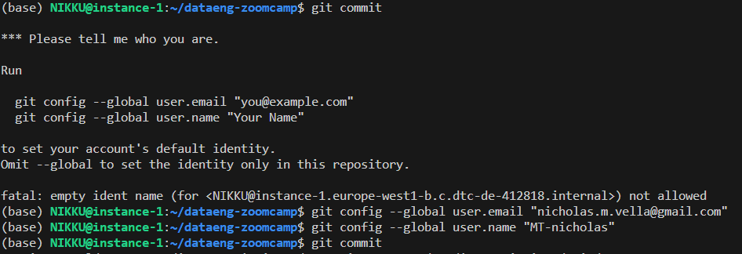

>[Back to Index](README.md)

>Next: [Data Ingestion](2_data_ingestion.md)

### Table of contents

- [Introduction to Data Engineering](#introduction-to-data-engineering)
  - [Architecture](#architecture)
  - [Data pipelines](#data-pipelines)
- [Docker and Postgres](#docker-and-postgres)
  - [Docker basic concepts](#docker-basic-concepts)
  - [Creating a custom pipeline with Docker](#creating-a-custom-pipeline-with-docker)
  - [Running Postgres in a container](#running-postgres-in-a-container)
  - [Ingesting data to Postgres with Python](#ingesting-data-to-postgres-with-python)
  - [Connecting pgAdmin and Postgres with Docker networking](#connecting-pgadmin-and-postgres-with-docker-networking)
  - [Using the ingestion script with Docker](#using-the-ingestion-script-with-docker)
    - [Exporting and testing the script](#exporting-and-testing-the-script)
    - [Dockerizing the script](#dockerizing-the-script)
  - [Running Postgres and pgAdmin with Docker-compose](#running-postgres-and-pgadmin-with-docker-compose)
  - [SQL refresher](#sql-refresher)
- [Terraform and Google Cloud Platform](#terraform-and-google-cloud-platform)
  - [GCP initial setup](#gcp-initial-setup)
  - [GCP setup for access](#gcp-setup-for-access)
  - [Terraform basics](#terraform-basics)
  - [Creating GCP infrastructure with Terraform](#creating-gcp-infrastructure-with-terraform)
- [Extra content](#extra-content)
  - [Setting up a development environment in a Google Cloud VM](#setting-up-a-development-environment-in-a-google-cloud-vm)
  - [Port mapping and networks in Docker](#port-mapping-and-networks-in-docker)

# Environment Configuration

VS Code can be used as an IDE, but you also need to choose your development environment.

Three main options for this course:
1. Local environment
1. Github Codespaces VM
1. GCP VM

It is recommended not to use a local environment; to start via github codespaces initially, and migrate into gcp vm at some point.

> Note that the terminal on vscode will be connected to the developmetn environment, and you can program in bash if the environmnent is linux-based, as if it were CMD on your local windows environment.

> This also means we should install the linux version of all software (e.g. terravision, docker, gcp) on the linux VM we choose.

> Note that each of these environments, although much preferable to a local environment setup where you have to install all software locally and navigate the complexity of windows, have a free tier beyond which payment is required.

_Example: Dashboard for Github Codespaces Free Tier_


# Introduction to Data Engineering
***Data Engineering*** is the design and development of systems for collecting, storing and analyzing data at scale.

## Architecture

During the course we will replicate the following architecture:


* [New York's Taxi and Limousine Corporation's Trip Records Dataset](https://github.com/DataTalksClub/data-engineering-zoomcamp/blob/main/dataset.md): the dataset we will use during the course.
* [Spark](https://spark.apache.org/): analytics engine for large-scale data processing (distributed processing).
* [Google BigQuery](https://cloud.google.com/products/bigquery/): serverless _data warehouse_ (central repository of integrated data from one or more disparate sources).
* [Airflow](https://airflow.apache.org/): workflow management platform for data engineering pipelines. In other words, a pipeline orchestration tool.
* [Kafka](https://kafka.apache.org/): unified, high-throughput,low-latency platform for handling real-time data feeds (streaming).

## Data pipelines

A **data pipeline** is a service that receives data as input and outputs more data. For example, reading a CSV file, transforming the data somehow and storing it as a table in a PostgreSQL database.


_[Back to the top](#table-of-contents)_

# Docker and Postgres

## Docker basic concepts

_([Video source](https://www.youtube.com/watch?v=EYNwNlOrpr0&list=PL3MmuxUbc_hJed7dXYoJw8DoCuVHhGEQb&index=3))_

**Docker** is a _containerization software_ that allows us to isolate software in a similar way to virtual machines but in a much leaner way.

A **Docker image** is a _snapshot_ of a container that we can define to run our software, or in this case our data pipelines. By exporting our Docker images to Cloud providers such as Amazon Web Services or Google Cloud Platform we can run our containers there.

Docker provides the following advantages:
* Reproducibility
* Local experimentation
* Integration tests (CI/CD)
* Running pipelines on the cloud (AWS Batch, Kubernetes jobs)
* Spark (analytics engine for large-scale data processing)
* Serverless (AWS Lambda, Google functions)

Docker containers are ***stateless***: any changes done inside a container will **NOT** be saved when the container is killed and started again. This is an advantage because it allows us to restore any container to its initial state in a reproducible manner, but you will have to store data elsewhere if you need to do so; a common way to do so is with _volumes_.

>Note: you can learn more about Docker and how to set it up on a Mac [in this link](https://github.com/ziritrion/ml-zoomcamp/blob/11_kserve/notes/05b_virtenvs.md#docker). You may also be interested in a [Docker reference cheatsheet](https://gist.github.com/ziritrion/1842c8a4c4851602a8733bba19ab6050#docker).

## Way of Working

Note that the way we will be working is as follows:
- We have created a **GitHub repo** (forked from notes made available by a third-party)
- The GitHub repo is hosted on **Codespaces**
- We are editing the Codespace through **Visual Studio Code**
- Within VS Code, we have a **terminal**, which we can use for bash script, etc.
- Within VS Code, we have extensions for **Python**, **Docker**, etc. and which we can use for all scripting
- A folder with working scripts will be created for each lesson, in the format *{lesson_number}_{lesson_name}*

## Creating a custom pipeline with Docker

### Python Script
_([Video source](https://www.youtube.com/watch?v=EYNwNlOrpr0&list=PL3MmuxUbc_hJed7dXYoJw8DoCuVHhGEQb&index=3))_

Let's create an example pipeline. We will create a dummy `pipeline.py` Python script that receives an argument and prints it.

```python
import sys

# print arguments
print(sys.argv)

# argument 0 is the name os the file
# argumment 1 contains the actual first argument we care about
day = sys.argv[1]

# cool pandas stuff goes here

# print a sentence with the argument
print(f'job finished successfully for day = {day}')
```

We can run this script with `python pipeline.py <some_number>` and it should print 2 lines:
* `['pipeline.py', '<some_number>']`
* `job finished successfully for day = <some_number>`

### Dockerfile

> To use Docker, we can use **Docker desktop** directly, or else use Docker through extensions from within **VS Code**.

> Docker is used to create containers; a container functions as a server, and in fact we can the front-end of the container through a web browser. 

> A container requires a name, and a host port.  Your local machine, in technical terms, is also referred to as “localhost”. Ref: [What is local host?](https://blog.hubspot.com/website/what-is-localhost)
Thus, if hosting a container on your own local machine, you will be able to access the front-end using http://localhost: 

Let's containerize our Python script by creating a Docker image. Create the folllowing `Dockerfile` file:

**Important Notes:**
- You always need an image to run a container.  Therefore we will first build an image, and then run a container using the image.
- A Dockerfile is the Docker image's source code. Thus, by running the same Dockerfile, the same identical container can be instantiated
- Reference material on syntax [1](https://www.geeksforgeeks.org/what-is-dockerfile-syntax/) and [2](https://docs.docker.com/engine/reference/builder/) for Dockerfiles
- **VVIMP**: A standard Dockerfile should be named `Dockerfile` (by default) and should have no extension (e.g. `.txt`)! Therefore make sure your file is not named `Dockerfile.txt` , especially since file extensions are hidden by default on Windows.

```dockerfile
# every Dockerfile starts with the base Docker image that we will build on
FROM python:3.9.1

# set up our image by installing prerequisite environment configurations; pandas in this case
RUN pip install pandas

# set up the working directory inside the container (standard procedure)
WORKDIR /app
# copy the script to the container: 1st name is source file, 2nd is destination (not sure about this)
COPY pipeline.py pipeline.py

# define what to do first when the container runs
# in this example, we will just run the script
# i.e. we are 'automating' the terminal input of "python", "pipeline.py"
ENTRYPOINT ["python, pipeline.py"]
```

> `FROM`: You cannot directly use multiple FROM instructions in a single Dockerfile. The FROM instruction is used to set the base image for your Docker image, and a Docker image can have only one base image. The base image defines the environment and tools available within the image. However, you can use multiple stages in a Dockerfile, each with its own FROM instruction. This is known as a multi-stage build. In a multi-stage build, you can use different base images in each stage and copy artifacts from one stage to another. This helps to keep the final image smaller and more focused.

> `RUN`: Since our base image is python, and this comes with pip pre-installed, we can run a pip command on our base image, which is specified in `FROM`

#### Build Image
Let's build the image:

```ssh
docker build -t test:pandas .
```
* `-t`, or `-tag`, denotes the argument for a tag, as follows: The image name will be `test` and its tag will be `pandas`. If the tag isn't specified it will default to `latest`. 
* note that we are required to provide the location of the Dockerfile; in this case, we are going to navigate to the Dockerfile's directory using `cd` prior to running `docker build ...` and will specify the location as `.` which means 'the current directory'

#### Run Container (using Image)
We can now run the container image and pass an argument to it, so that our pipeline will receive it:

```ssh
docker run -it test:pandas some_number
```
* The `-it` argument implies that you want an interactive session. This means that you can interact with the session and, for example use `Ctrl+C` to quit the session.
* We reference the image by `name:tag`, as specified when built
* You should get the same output you did when you ran the pipeline script by itself.

>Note: It is important to note that the config file needs to be named 'Dockerfile' with no extension and also you need to run the docker commnds (`docker build ...` and `docker run ...`) from the directory where you saved this file; therefore you must first `cd` into the right directory. These instructions are assuming that `pipeline.py` and `Dockerfile` are in the same directory.

## Running Postgres in a container

_([Video source](https://www.youtube.com/watch?v=2JM-ziJt0WI&list=PL3MmuxUbc_hJed7dXYoJw8DoCuVHhGEQb&index=4))_

In later parts of the course we will use Airflow, which uses PostgreSQL internally. For simpler tests we can use PostgreSQL (or just Postgres) directly.

You can run a containerized version of Postgres that doesn't require any installation steps. You only need to provide a few _environment variables_ to it as well as a _volume_ for storing data.

Create a folder anywhere you'd like for Postgres to store data in. We will use the example folder `ny_taxi_postgres_data`. Here's how to run the container:

> Note that [`docker run`](https://docs.docker.com/engine/reference/commandline/container_run/) can be used to run a 'custom' docker image that was developed and built prior, or else to run a pre-configured image. [Docker Hub](http://hub.docker.com/) has over 100,000 images created by developers that you can run locally. You can search for Docker Hub images and run them directly from Docker Desktop. Many images hosted on Docker Hub have a description that highlights what settings must be set in order to run them. It will take some time to download the first time, but will be cached for future use. 

```bash
docker run -it \
    -e POSTGRES_USER="root" \
    -e POSTGRES_PASSWORD="root" \
    -e POSTGRES_DB="ny_taxi" \
    -v $(pwd)/ny_taxi_postgres_data:/var/lib/postgresql/data \
    -p 5432:5432 \
    postgres:13
```
* The container needs 3 environment variables:
    * `POSTGRES_USER` is the username for logging into the database. We chose `root`.
    * `POSTGRES_PASSWORD` is the password for the database. We chose `root`
        * ***IMPORTANT: These values are only meant for testing. Please change them for any serious project.***
    * `POSTGRES_DB` is the name that we will give the database. We chose `ny_taxi`.
* the `-e` (or `-env`) is for specifying environmental variables
* `-v` points to the volume directory. The colon `:` separates the first part (path to the folder in the host computer) from the second part (path to the folder inside the container).
    * Path names must be absolute. If you're in a UNIX-like system, you can use `pwd` to print you local folder as a shortcut; this example should work with both `bash` and `zsh` shells, but `fish` will require you to remove the `$`.
    * This command will only work if you run it from a directory which contains the `ny_taxi_postgres_data` subdirectory you created above.
    * If you are operating on windows, you need to provide the full absolute directory, in the format `c:\...\...`
    * Note that the `\` symbol lets us do a line break
* The `-p` is for port mapping. We map the default Postgres port to the same port in the host.
* The last argument is the image name and tag. We run the official `postgres` image on its version `13`.

### Viewing all active Docker containers

To view all  Docker containers, we can use
```bash
docker ps       # view all active containers
docker ps -a    # view all active and non-active containers (history)
```

### Remove Docker containers
Quite clearly, you should stop the docker container first and then remove it:
``` bash
docker stop container_id_or_name
docker rm container_id_or_name
```
> Note that we can also specify multiple containers in a one-liner

## Accessing PostGres DB using pgcli (SKIP)
The [pgcli](https://www.pgcli.com/) client is an interactive command-line interface for Postgres. Once the Docker container is running, we can log into our database through pgcli with the following command:

> `psql` is the default command-line front end to PostgreSQL, but `pgcli` provides a more intuitive interface

```bash
pgcli -h localhost -p 5432 -u root -d ny_taxi
```
* `-h` is the host. Since we're running locally we can use `localhost`.
* `-p` is the port.
* `-u` is the username.
* `-d` is the database name.
* The password is not provided; it will be requested after running the command.

## Connecting pgAdmin and Postgres with Docker networking and Docker Volume


_([Video source](https://www.youtube.com/watch?v=hCAIVe9N0ow&list=PL3MmuxUbc_hJed7dXYoJw8DoCuVHhGEQb&index=5))_

`pgcli` is a handy tool but it's cumbersome to use. [`pgAdmin` is a web-based tool](https://www.pgadmin.org/) that makes it more convenient to access and manage our databases. Similarly here, we could install pgAdmin locally ... but we could also install it in a dedicated Docker container, by pulling in a Docker image that contains the tool. In fact, it's possible to run pgAdmin as as container along with the Postgres container, but both containers will have to be in the same _virtual network_ so that they can find each other.

A quick google search of `pgadmin docker` will bring up the official page from `pgadmin` website. We can click download > Docker, to get instructions on how to download docker image, available [here](https://www.pgadmin.org/download/pgadmin-4-container/), which links us to the Docker documentation available [here](https://www.pgadmin.org/docs/pgadmin4/latest/container_deployment.html). From here, we get the command we need to use to get the pgadmin image:

``` bash
docker pull dpage/pgadmin4:<tag name>   # default tag name is `latest` i.e. most recent
```
> Note this step is **not required**, since when you run an image which is not available already, Docker will automatically attempt to pull the latest version. However, explicitly using docker pull can be useful when you want to ensure you have the latest version of the image or if you prefer to pull it separately for any reason.

### Docker network
However note that, before we go ahead and create the pgadmin container, we need to make sure that the two docker containers (pgadmin, postgres database) are created on the same network, to be able to see each other. Otherwise, we get an error similar to:


Once again, quick google search for `docker network create` gives us the following [guidance](https://docs.docker.com/engine/reference/commandline/network_create/).

Let's create a virtual Docker network called `pg-network`:

```bash
docker network create pg-network
```

That's all it takes to create a network! You can look at the existing networks with `docker network ls`. You can remove the network later with the command `docker network rm pg-network`. 

### Docker Volume

Recall how a Docker container is not persistent. However, in the context of creating a Database, having persistent storage is desirable.
- A `Docker volume` is a way to persistently store data generated by a Docker container. It is a separate entity from the container itself and exists independently.
- Volumes are used to share data between containers or to persist data even if the container is removed.
- Volumes can offer better performance than using **bind mounts** (local directories) because they are managed by Docker and can be optimized for specific use cases.
- Docker volumes therefore provide a more robust and flexible solution for handling persistent data in Docker containers compared to local directories.

Let's create a virtual Docker volume called `dtc_postgres_volume_local`:

```bash
docker volume create dtc_postgres_volume_local
```

That's all it takes to create a volume! You can look at the existing networks with `docker volume ls`. You can remove the network later with the command `docker volume rm dtc_postgres_volume_local`. 

### View Docker Items (?)

To view Docker Items (?), navigate here from VS Studio Code Docker Extension:


### Re-starting Inactive Containers

After some time, Docker containers will 'stop' automatically (i.e. sleep). You can also stop them manually.

To re-start, can use terminal or GUI as follows from Docker pane:


### Re-running containers with Docker networking, and Docker Volumes
We will now re-run (i.e. re-create) our `Postgres container` with the added network, so that the pgAdmin container can later find it from the same network (we'll use `pg-database` for the container name). We will also use the docker volume for storage

```bash
docker run -it \
    -e POSTGRES_USER="root" \
    -e POSTGRES_PASSWORD="root" \
    -e POSTGRES_DB="ny_taxi" \
    -v dtc_postgres_volume_local:/var/lib/postgresql/data \
    -p 5432:5432 \
    --network=pg-network \
    --name pg-database \
    postgres:13
```

And now, we will now run the `pgAdmin container` on another terminal on the same network:

```bash
docker run -it \
    -e PGADMIN_DEFAULT_EMAIL="admin@admin.com" \
    -e PGADMIN_DEFAULT_PASSWORD="root" \
    -p 8080:80 \
    --network=pg-network \
    --name pgadmin \
    dpage/pgadmin4
```
Notes:
* The container needs 2 environment variables: a login email and a password. We use `admin@admin.com` and `root` in this example. These are example values for testing and should never be used on production. Change them accordingly when needed.
* **Ports**: pgAdmin is a web app and its default port is 80; we map it to 8080 in our localhost to avoid any possible conflicts.
* **Network**: Just like with the Postgres container, we specify the network.
* **Name**: We also specify a container name; however, the name in this example isn't really necessary because there won't be any containers trying to access this particular container (rather, it is this container which will attempt to access the others)
* The actual image name for the pgadmin tool is `dpage/pgadmin4` .

You should now be able to load pgAdmin on a web browser by browsing to `localhost:8080`. Use the same email and password you used for running the container to log in.

Note that we can also view a list of ports by going to:


### Connecting PostGres DB to PGAdmin by Adding Server

Under Quick Links, navigate to "Add New Server" ..._


Under _General_ give the Server a name and under _Connection_ add the same host name, user and password you used when running the container.
> Host name/address = DB name; this is required so that pgadmin finds the DB

**Fix steps**


Click on _Save_. You should now be connected to the database.


We will explore using pgAdmin in later lessons.


## Ingesting data to Postgres with Python (using `pd.to_sql()`)

_([Video source](https://www.youtube.com/watch?v=2JM-ziJt0WI&list=PL3MmuxUbc_hJed7dXYoJw8DoCuVHhGEQb&index=4))_

We will now create a Jupyter Notebook `upload-data.ipynb` [in this link](../1_intro/upload-data.ipynb) file which we will use to read a single 'sample' data file, and export it to Postgres.

We will use data from the [NYC TLC Trip Record Data website](https://www1.nyc.gov/site/tlc/about/tlc-trip-record-data.page). Specifically, we will use the **Yellow taxi trip records CSV file for January 2021**. A dictionary to understand each field is available [here](https://www1.nyc.gov/assets/tlc/downloads/pdf/data_dictionary_trip_records_yellow.pdf).

In the same directory of the .`ipynb` you will need to have the CSV file linked above _(and the `ny_taxi_postgres_data` subdirectory (?))_.

> Note that the file type is .parquet, which can be converted to .csv by Pandas automatically.

>Note: knowledge of Jupyter Notebook, Python environment management and Pandas is asumed in these notes. Please check [this link](https://gist.github.com/ziritrion/9b80e47956adc0f20ecce209d494cd0a#pandas) for a Pandas cheatsheet and [this link](https://gist.github.com/ziritrion/8024025672ea92b8bdeb320d6015aa0d) for a Conda cheatsheet for Python environment management.

## Interfacing with Postgres DB
Throughout this course, three alternative ways of interfacing with Postgres DB are discussed:
1. Using `pgcli`, a terminal command-line interface [not recommended, lots of config required]
2. Using `pgadmin` GUI interface [**recommended**] (refer to `upload-data.ipynb`)
3. Using `SQLAlchemy` python interface via `pd.read_sql()` [**recommended**] (refer to `upload-data.ipynb`)

For more on SQL Alchemy, refer to ([this video](https://www.youtube.com/watch?v=3IkfkTwqHx4&list=PL3MmuxUbc_hJed7dXYoJw8DoCuVHhGEQb&index=6))


## Using the ingestion script with Docker

_([Video source](https://www.youtube.com/watch?v=B1WwATwf-vY&list=PL3MmuxUbc_hJed7dXYoJw8DoCuVHhGEQb&index=8))_

We will now prepare the regular python sript (i.e. removed from all the 'notebook clutter' from the .ipynb and converted to a .py) and run it using Docker as part of our automated pipeline.

### Exporting and testing the script

If using jupyter notebooks for progamming in python, you can export the `.ipynb` notebook file as a `.py` with the below command. The file will be generated in the same directory.

```bash
jupyter nbconvert --to=script upload-data.ipynb
```

Clean up the script by removing everything we don't need (e.g. `print` statements, etc.).

We will also rename it to `ingest_data.py` and add a few modifications:

* We will use [argparse](https://docs.python.org/3/library/argparse.html) to handle the following command line arguments:
    * Username
    * Password
    * Host
    * Port
    * Database name
    * Table name
    * URL for the CSV file
> The `argparse` module makes it easy to write user-friendly **command-line interfaces**. The program (i.e. the python script)can define what arguments it requires on-the-fly, and `argparse` will parse the `params` out of `sys.argv` as per the configuration provided (ref: `ingest_data.py`).
* We also create the `if __name__ == '__main__'` clause for best-practice. This is where we also configure `argparse`.
* The _engine_ we created for connecting to Postgres will be tweaked so that we pass the parameters and build the URL from them, like this:
    ```python
    engine = create_engine(f'postgresql://{user}:{password}@{host}:{port}/{db}')
    ```
* We will also download the CSV using the provided URL argument.


You can check the completed `ingest_data.py` script [in this link](../1_intro/ingest_data.py).

In order to test the script we will have to drop the table we previously created. In pgAdmin, in the sidebar navigate to _Servers > Docker localhost > Databases > ny_taxi > Schemas > public > Tables > yellow_taxi_data_, right click on _yellow_taxi_data_ and select _Query tool_. Introduce the following command:

```sql
DROP TABLE yellow_taxi_data;
```

We are now ready to test the script with the following command:

```bash
python ingest_data.py \
    --user=root \
    --password=root \
    --host=localhost \
    --port=5432 \
    --db=ny_taxi \
    --table_name=yellow_taxi_trips \
    --url="https://github.com/DataTalksClub/nyc-tlc-data/releases/download/yellow/yellow_tripdata_2021-01.csv.gz"
```
**Note that we've changed the table name from `yellow_taxi_data` to `yellow_taxi_trips`.**

Back in pgAdmin, refresh the Tables (right-click > Refresh) and check that `yellow_taxi_trips` was created. You can also run a SQL query to check the contents:

```sql
SELECT
    COUNT(1)
FROM
    yellow_taxi_trips;
```
* This query should return 1,369,765 rows.

### Dockerizing the script

Let's modify the [Dockerfile we created before](#creating-a-custom-pipeline-with-docker) to include our `ingest_data.py` script and create a new image (instead of our `pipeline.py` script)

```dockerfile
FROM python:3.9.1

# In most Linux distributions, 'wget' comes pre-installed. If it's not, you can install it by running the command `apt-get install wget`. We need this to download the .csv file
RUN apt-get install wget
# psycopg2 is a postgres db adapter for python: sqlalchemy needs it. It may be included with pandas and sqlalchemy, but better to be sure this way.
RUN pip install pandas sqlalchemy psycopg2

WORKDIR /app
COPY ingest_data.py ingest_data.py 

ENTRYPOINT [ "python", "ingest_data.py" ]
```
With our previous containers for `pgadmin` and `postgresdb` still running, build our new `ingest_data` image by running in terminal:
```bash
docker build -t taxi_ingest:v001 .
```

And run it:
```bash
docker run -it \
    --network=pg-network \
    taxi_ingest:v001 \
        --user=root \
        --password=root \
        --host=pg-database \
        --port=5432 \
        --db=ny_taxi \
        --table_name=yellow_taxi_trips \
        --url="https://github.com/DataTalksClub/nyc-tlc-data/releases/download/yellow/yellow_tripdata_2021-01.csv.gz"
```
* `Docker network`: We need to provide the `network` for Docker to find the Postgres container. It goes before the name of the image. `network` is a parameter for Docker whilst the other parameters are for our Python script. We can specify this using indenentation
* `Host name`: Our Python script does not connect to the PGAdmin Container, but needs to connect to the PostgresDB container. Since Postgres is running on a separate container from the Python script, for which we are building a seperate container, the `host` argument should be changed to point to the container name of PostgresDB (rather than: `localhost`, as we saw previously -- because **when you use `localhost` in a container, this refers to the container itself!**).
* You could have dropped any existing table of data in the PostgresDB via pgAdmin beforehand if you wanted, but the script will automatically replace the pre-existing table.
* Note that in reality, rather than creating a `docker network` and accesssing a local database on our local network through `host`, we would have a database that runs on the cloud, and use the url of this database for the `host` parameter.
* Moreover, note that rather than passing arugments through Docker, we could have e.g. Kubernetes job, Airflow, etc.


## Running Postgres and pgAdmin with Docker-compose

_([Video source](https://www.youtube.com/watch?v=hKI6PkPhpa0&list=PL3MmuxUbc_hJed7dXYoJw8DoCuVHhGEQb&index=7))_

So far, we are using three docker images to run three seperate docker containers: 1) `postgres`, 2) `pgadmin`, 3) `.py script`

`docker-compose` is a utility which allows us to **launch multiple containers using a single configuration file**, so that we don't have to run multiple complex `docker run` commands separately.

> You can test whether `docker-compose` is installed by simply running `docker-compose` in terminal and checking if this generates an output.

> Check out this [getting started guide](https://docs.docker.com/compose/gettingstarted/) for tips on `docker-compose`.

> In a `docker-compose` file, we will prepare, in semi-structured format, a list of all the services we want to run, and the parameters for each service.

Docker compose makes use of `YAML` files and must be denoted as `file-name.yaml`, in the format:

```yaml
services:
    service1_name:
        image:
            # image name
        environment:
            # environment parameters
        volume:
            # host_path:container_path:mode mapping
        ports:
            # host_port:container_port mapping
    service2_name:
        ...
```

Here's the `docker-compose.yaml` file for running the `Postgres` and `pgAdmin` containers:


```yaml
services:
  pgdatabase:
    image: postgres:13
    environment:
      - POSTGRES_USER=root
      - POSTGRES_PASSWORD=root
      - POSTGRES_DB=ny_taxi
    volumes:
      - "./ny_taxi_postgres_data:/var/lib/postgresql/data:rw"
    ports:
      - "5432:5432"
  pgadmin:
    image: dpage/pgadmin4
    environment:
      - PGADMIN_DEFAULT_EMAIL=admin@admin.com
      - PGADMIN_DEFAULT_PASSWORD=root
    volumes:
      - "./data_pgadmin:/var/lib/pgadmin"
    ports:
      - "8080:80"
```
* Note that there are two levels of parameters: parameters for the service (e.g. `image`, `volumes`, `port`), and parameters for the environment (e.g. `POSTGRES_USER`, `POSTGRES_PASSWORD`, etc.).
* We don't have to specify a network because `docker-compose` takes care of it: every single container (or "service", as the file states) will run withing the same network and will be able to find each other according to their names (`pgdatabase` and `pgadmin` in this example).
* We have created and considerd a new volume for pgAdmin to save its settings, so that you don't have to keep re-creating the connection to Postgres every time you rerun the container. Make sure you create a `data_pgadmin` directory in your work folder where you run `docker-compose` from.
* All other details from the `docker run` commands (environment variables, volumes and ports) are mentioned accordingly in the file following YAML syntax; we are re-organising the parameters in the docker scripts into a one single YAML file.

We can now run Docker compose by running the following command from the same directory where `docker-compose.yaml` is found.

**Make sure that all previous containers aren't running anymore, or else there may be conflicts**

```bash
docker-compose up
```

>Note: this command asumes that the `ny_taxi_postgres_data` and `data_pgadmin` used for mounting the volumes are in the same directory as `docker-compose.yaml`.

Since the settings for pgAdmin were stored within the container and we have killed the previous one, you will have to re-connect PostGres DB to PGAdmin by Adding Server as seen in previous sections.


You will have to press `Ctrl+C` in order to shut down the containers. The proper way of shutting them down is with this command:

```bash
docker-compose down
```

And if you want to run the containers again in the background rather than in the foreground (thus freeing up your terminal), you can run them in detached mode:

```bash
docker-compose up -d
```


## Including .py data ingestion script in docker-compose

**FIGURE THIS OUT: For some reason, this is not covered in detail ...**

If you want to re-run the dockerized ingest script when you run Postgres and pgAdmin with `docker-compose`, you will have to find the name of the virtual network that Docker compose created for the containers. You can use the command `docker network ls` to find it and then change the `docker run` command for the dockerized script to include the network name.

## SQL refresher

Below are a series of SQL query examples to remember how SQL works. For this example we'll asume that we're working with 2 tables named `trips` (list of all yelow taxi trips of NYC for January 2021) and `zones` (list of zone IDs for pick ups and drop offs).

>Check the [homework](https://github.com/DataTalksClub/data-engineering-zoomcamp/blob/main/week_1_basics_n_setup/homework.md) for the session to learn about the `zones` table.

>For a more detailed look into SQL, check out [this article](https://towardsdatascience.com/sql-in-a-nutshell-part-1-basic-real-world-scenarios-33a25ba8d220).

```sql
SELECT
    *
FROM
    trips
LIMIT 100;
```
* Selects all rows in the `trips` table. If there are more than 100 rows, select only the first 100.

```sql
SELECT
    *
FROM
    trips t,
    zones zpu,
    zones zdo
WHERE
    t."PULocationID" = zpu."LocationID" AND
    t."DOLocationID" = zdo."LocationID"
LIMIT 100;
```
* Selects all rows in the `trips` table. If there are more than 100 rows, select only the first 100.
* We give aliases to the `trips` and `zones` tables for easier access.
* We replace the IDs inside `PULocationID` and `DOLocationID` with the actual zone IDs for pick ups and drop offs.
* We use double quotes (`""`) for the column names because in Postgres we need to use them if the column names contains capital letters.

```sql
SELECT
    tpep_pickup_datetime,
    tpep_dropoff_datetime,
    total_amount,
    CONCAT(zpu."Borough", '/', zpu."Zone") AS "pickup_loc",
    CONCAT(zdo."Borough", '/', zdo."Zone") AS "dropoff_loc"
FROM
    trips t,
    zones zpu,
    zones zdo
WHERE
    t."PULocationID" = zpu."LocationID" AND
    t."DOLocationID" = zdo."LocationID"
LIMIT 100;
```
* Same as previous but instead of the complete rows we only display specific columns.
* We make use of ***joins*** (_implicit joins_ in this case) to display combined info as a single column.
    * The new "virtual" column `pickup_loc` contains the values of both `Borough` and `Zone` columns of the `zones` table, separated by a slash (`/`).
    * Same for `dropoff_loc`.
* More specifically this is an ***inner join***, because we only select the rows that overlap between the 2 tables.
* Learn more about SQL joins [here](https://dataschool.com/how-to-teach-people-sql/sql-join-types-explained-visually/) and [here](https://www.wikiwand.com/en/Join_(SQL)).

```sql
SELECT
    tpep_pickup_datetime,
    tpep_dropoff_datetime,
    total_amount,
    CONCAT(zpu."Borough", '/', zpu."Zone") AS "pickup_loc",
    CONCAT(zdo."Borough", '/', zdo."Zone") AS "dropoff_loc"
FROM
    trips t JOIN zones zpu
        ON t."PULocationID" = zpu."LocationID"
    JOIN zones zdo
        ON t."DOLocationID" = zdo."LocationID"
LIMIT 100;
```
* Exactly the same statement as before but rewritten using explicit `JOIN` keywords.
    * Explicit inner joins are preferred over implicit inner joins.
* The `JOIN` keyword is used after the `FROM` statement rather than the `WHERE` statement. The `WHERE` statement is actually unneeded.
    ```sql
    SELECT whatever_columns FROM table_1 JOIN table_2_with_a_matching_column ON column_from_1=column_from_2
    ```
* You can also use the keyword `INNER JOIN` for clarity.
* Learn more about SQL joins [here](https://dataschool.com/how-to-teach-people-sql/sql-join-types-explained-visually/) and [here](https://www.wikiwand.com/en/Join_(SQL)).

```sql
SELECT
    tpep_pickup_datetime,
    tpep_dropoff_datetime,
    total_amount,
    "PULocationID",
    "DOLocationID"
FROM
    trips t
WHERE
    "PULocationID" is NULL
LIMIT 100;
```
* Selects rows from the `trips` table whose pick up location is null and displays specific columns.
* If you have not modified the original tables, this query should return an empty list.

```sql
SELECT
    tpep_pickup_datetime,
    tpep_dropoff_datetime,
    total_amount,
    "PULocationID",
    "DOLocationID"
FROM
    trips t
WHERE
    "DOLocationID" NOT IN (
        SELECT "LocationID" FROM zones
    )
LIMIT 100;
```
* Selects rows fromn the `trips` table whose drop off location ID does not appear in the `zones` table.
* If you did not modify any rows in the original datasets, the query would return an empty list.

```sql
DELETE FROM zones WHERE "LocationID" = 142;
```
* Deletes all rows in the `zones` table with `LocationID` of 142.
* If we were to run this query and then run the previous query, we would get a list of rows with `PULocationID` of 142.

```sql
SELECT
    tpep_pickup_datetime,
    tpep_dropoff_datetime,
    total_amount,
    CONCAT(zpu."Borough", '/', zpu."Zone") AS "pickup_loc",
    CONCAT(zdo."Borough", '/', zdo."Zone") AS "dropoff_loc"
FROM
    trips t LEFT JOIN zones zpu
        ON t."PULocationID" = zpu."LocationID"
    LEFT JOIN zones zdo
        ON t."DOLocationID" = zdo."LocationID"
LIMIT 100;
```
* Similar to the join query from before but we use a ***left join*** instead.
* ***Left joins*** shows all rows from the "left" part of the statement but only the rows from the "right" part that overlap with the "left" part, thus the name.
* This join is useful if we deleted one of the `LocationID` rows like before. The inner join would omit some rows from the `trips` table, but this query will show all rows. However, since one ID is missing, the "virtual" columns we defined to transform location ID's to actual names will appear with empty strings if the query cannot find the location ID.
* Learn more about SQL joins [here](https://dataschool.com/how-to-teach-people-sql/sql-join-types-explained-visually/) and [here](https://www.wikiwand.com/en/Join_(SQL)).

```sql
SELECT
    tpep_pickup_datetime,
    tpep_dropoff_datetime,
    DATE_TRUNC('DAY', tpep_pickup_datetime),
    total_amount,
FROM
    trips t
LIMIT 100;
```
* Selects all rows from the `trips` table but displays specific columns.
* `DATE_TRUNC` is a function that trunctates a timestamp. When using `DAY` as a parameter, it removes any smaller values (hours, minutes, seconds) and displays them as `00:00:00` instead.

```sql
SELECT
    tpep_pickup_datetime,
    tpep_dropoff_datetime,
    CAST(tpep_pickup_datetime AS DATE) as "day",
    total_amount,
FROM
    trips t
LIMIT 100;
```
* Very similar to previous query, but instead it casts the `TIMESTAMP` type to `DATE`, so that the hours:minutes:seconds info is completely omitted rather than show as `00:00:00`. The columns will be displayed under the name `day`.

```sql
SELECT
    CAST(tpep_pickup_datetime AS DATE) as "day",
    COUNT(1)
FROM
    trips t
GROUP BY
    CAST(tpep_pickup_datetime AS DATE)
ORDER BY "day" ASC;
```
* Counts the amount of records in the `trips` table grouped by day.
* We remove the limit of 100 records because we do not want to restrict the amount of info on screen.
* Grouping does not guarantee order, so we enforce that the rows will be displayed in ascending order from earliest to latest day.

```sql
SELECT
    CAST(tpep_pickup_datetime AS DATE) as "day",
    COUNT(1) as "count",
    MAX(total_amount),
    MAX(passenger_count)
FROM
    trips t
GROUP BY
    CAST(tpep_pickup_datetime AS DATE)
ORDER BY "count" DESC;
```
* Similar to the previous query but orders the rows by count and displays them in descending order, so that the day with the highest amount of trips is shown first.
* We also show the maximum amount that a driver earned in a trip for that day and the maximum passenger count on a single trip for that day.

```sql
SELECT
    CAST(tpep_pickup_datetime AS DATE) as "day",
    "DOLocationID",
    COUNT(1) as "count",
    MAX(total_amount),
    MAX(passenger_count)
FROM
    trips t
GROUP BY
    1, 2
ORDER BY "count" DESC;
```
* Similar to previous but we also include the drop off location column and we group by it as well, so that each row contains the amount of trips for that location by day.
* Instead of having to repeat the same line in both the `SELECT` and `GROUP BY` parts, we can simply indicate the arguments we use after the `SELECT` keyword by order number.
    * SQL is 1-indexed. The first argument is 1, not 0.

```sql
SELECT
    CAST(tpep_pickup_datetime AS DATE) as "day",
    "DOLocationID",
    COUNT(1) as "count",
    MAX(total_amount),
    MAX(passenger_count)
FROM
    trips t
GROUP BY
    1, 2
ORDER BY
    "day" ASC,
    "DOLocationID" ASC;
```
* Similar to previous query but we now order by ascending order both by day and then drop off location ID, both in ascending order.

As a final note, SQL commands can be categorized into the following categories:
* ***DDL***: Data Definition Language.
    * Define the database schema (create, modify, destroy)
    * `CREATE`, `DROP`, `ALTER`, `TRUNCATE`, `COMMENT`, `RENAME`
* ***DQL***: Data Query Language.
    * Perform queries on the data within schema objects. Get data from the database and impose order upon it.
    * `SELECT`
* ***DML***: Data Manipulation Language.
    * Manipulates data present in the database.
    * `INSERT`, `UPDATE`, `DELETE`, `LOCK`...
* ***DCL***: Data Control Language.
    * Rights, permissions and other controls of the database system.
    * Usually grouped with DML commands.
    * `GRANT`, `REVOKE`
* ***TCL***: Transaction Control Language.
    * Transactions within the database.
    * Not a universally considered category.
    * `COMMIT`, `ROLLBACK`, `SAVEPOINT`, `SET TRANSACTION`

_[Back to the top](#table-of-contents)_

# Terraform and Google Cloud Platform

[Video Source](https://www.youtube.com/watch?v=Hajwnmj0xfQ&t=1046s)

## GCP
During this course we will use [Google Cloud Platform](https://cloud.google.com/) (GCP) as our cloud services provider.

### GCP Installation

Download the [GCP SDK](https://cloud.google.com/sdk/docs/quickstart) for local setup. Follow the instructions to install and connect to your account and project.

> A software development kit (SDK) is a set of platform-specific building tools like debuggers, compilers, and libraries. SDKs bring third-party tools and resources to your environment. In contrast, an application programming interface (API) is a mechanism that enables two software components to communicate with each other using predetermined protocols. You can use APIs to communicate with existing software components and integrate predeveloped functionality in your code. SDKs may include APIs among several other resources for the platform they support. Similarly, you can use SDKs to create new APIs that you can share with others. Both SDKs and APIs make the software development process more efficient and collaborative.
    
To check whether the Google Cloud SDK has been installed successfully on your machine, in the Windows Terminal, type `gcloud -v`. 
    
(

Note that so far, we have not connected to our google cloud account.

> It is helpful to also download and install the extension `Google Cloud Code`
    

### GCP initial setup

GCP is organized around **projects**. You may create a project and access all available GCP resources and services from the project dashboard.

We will now create a **project** and a **service account**, and we will download the authentication keys to our computer.

> A **service account** is like a user account but for apps and workloads; you may authorize or limit what resources are available to your apps with service accounts. Usually, no users will log into a service account.

Please follow these steps:

1. **Create an account on GCP.**
    > You should receive $300 in credit when signing up on GCP for the first time with an account.
1. **Setup a new project and write down the Project ID.**
    1. From the GCP Dashboard, click on the drop down menu next to the _Google Cloud Platform_ title to show the project list and click on _New project_.
    1. Give the project a name. We will use `dtc-de` in this example.
    1. Every project must have a unique **Project ID** (`projectname-number`)
        >You can use the autogenerated Project ID (this ID must be unique to all of GCP, not just your account).
    1. Leave the organization as _No organization_.
    1. Click on _Create_.
    1. Back on the dashboard, make sure that your project is selected.
        >Click on the previous drop down menu to select it otherwise.
1. **Setup a service account for this project and download the JSON authentication key files.**
    1. _IAM & Admin_ > _Service accounts_ > _Create service account_
    
    1. Provide a service account name. We will use `dtc-de-user`. Leave all other fields with the default values. Click on _Create and continue_.
        > Note that a unique service accout id is created in the format `service-accout-name@projectID...serviceaccout...`
    1. Grant the Viewer role (_Basic_ > _Viewer_) to the service account and click on _Continue_
    1. There is no need to grant users access to this service account at the moment. Click on _Done_.
    1. With the service account created, click on the 3 dots below _Actions_ and select _Manage keys_.
    1. _Add key_ > _Create new key_. Select _JSON_ and click _Create_. The files will be downloaded to your computer. Save them to a folder and write down the path.
        > The key is typically named: `ProjectID-keyID.json`
    1. It is cructial that you do not push to Git / backup on cloud/ etc. unless you can be sure the keys are safe and private. To address this concern in your git environment, find the file `..gitignore`. This contains a list of files and files types that `git` will ignore when pushing changes. Make sure `*.json` is added to this file, so that any .json files will not be pushed to the cloud.
        > If someone gets the key, they can access the cloud environment and consume resources (incurrring EU)

1. **Authenticate Google Cloud SDK to Google Cloud Account, using an environment variable that is set to point to the auth keys.**
    1. The environment variable name that will be checked for credentials by the Google Cloud SDK by default is `GOOGLE_APPLICATION_CREDENTIALS`
    1. The value for the variable should be set to the path containing the json authentication file you downloaded previously.
    1. _**Check how to assign environment variables in your system and shell!**_
        > We are working in bash on terminal connected to GitHub Codespaces at the time of writing.
    
        - In bash, the command should be:
            ```bash
            export GOOGLE_APPLICATION_CREDENTIALS="<path/to/authkeys>.json"
            ```
        - In windows terminal ([source](https://www3.ntu.edu.sg/home/ehchua/programming/howto/Environment_Variables.html)), the command should be:
            ```bash
            set GOOGLE_APPLICATION_CREDENTIALS = <path/to/authkeys>.json
            ```
    1. Refresh the token and verify the authentication with the GCP SDK:
        ```bash
        gcloud auth application-default login
        ```
        - You will get a message asking you to confirm that you want to use the custom environment variable's keys, as opposed to the default keys linked to the owner.
        
        - We do, of course, because we want to use the key associated with the service account, so confirm _Yes_.
        - You will be prompted to log into your account via browser and to give access to the `GoogleAuthLibrary`.
        - If successful, you should get:
        
        
        > Note this is necessary each time your session expires

Your local environment should now be ready to work with the GCP environment.

> Note: The method followed in these notes is known as `OAuth`

### GCP setup for access

_([Video source](https://youtu.be/Hajwnmj0xfQ?t=1046&si=Vkg8kh9aLVv2vFCW))_

In the following chapters we will setup a _Data Lake_ on Google Cloud Storage (storing data in `buckets` as `flat files`, in an organised and compressed format) and a _Data Warehouse_ in BigQuery. We will explore these concepts in future lessons but a Data Lake is where we would usually store data and a Data Warehouse provides a more structured way to access this data.

We need to setup access first by assigning the Storage Admin, Storage Object Admin, BigQuery Admin and Viewer IAM roles to the Service Account, and then enable the `iam` and `iamcredentials` APIs for our project.

> We are assigning very powerful roles for the purpose of the tutorial; not advisble in reality, where you would generally not use the pre-defined GCP roles, but instead create custom roles where specific permissions are assigned over specific resources.

> It is also common practice to create different service accounts for each service (e.g. Terraform, vs. Datapipelines, etc.) with the right level of permissions for each.

Please follow these steps:

1. Assign the following IAM Roles to the Service Account: `Storage Admin`, `Storage Object Admin`, `BigQuery Admin` and `Viewer`.
    1. On the GCP Project dashboard, go to _IAM & Admin_ > _IAM_
    1. Select the previously created Service Account and edit the permissions by clicking on the pencil shaped icon on the left.
    1. Add the following roles and click on _Save_ afterwards:
        * `Storage Admin`: for creating and managing _buckets_.
        * `Storage Object Admin`: for creating and managing _objects_ within the buckets.
        * `BigQuery Admin`: for managing BigQuery resources and data.
        * `Viewer` should already be present as a role.
1. Enable APIs for the project (these are needed so that Terraform can interact with GCP):
   * https://console.cloud.google.com/apis/library/iam.googleapis.com
   * https://console.cloud.google.com/apis/library/iamcredentials.googleapis.com

   
    > Note that whenever local account interacts with cloud resources, it does not interact with the cloud resource directly, it interacts through APIs, so APIs enable the communication between local and cloud resources
1. Make sure that the `GOOGLE_APPLICATION_CREDENTIALS` environment variable is set.


## Terraform
### Terraform Introduction
[Terraform](https://www.terraform.io/) is an [infrastructure as code](https://www.wikiwand.com/en/Infrastructure_as_code) tool.

It  allows us to provision infrastructure resources through code, thus making it possible to handle infrastructure as an additional software component and take advantage of tradtional software tools and utilities, such as version control.

A great benefit is: declarative programming langauge, as opposed to imperative. Consequently, current config file always contains an up-to-date description of the current infrastrcture set-up.

### Terraform Providers
A provider in Terraform is a plugin that enables interaction with an API. This includes Cloud providers and Software-as-a-service providers. Most cloud providers (AWS, Azure, GCP) have Terraform providers, as seen on the list of providers on Terraform website.

This means that, using Terraform, a company can easily manage its cloud infrastructure in a multi-cloud environment, in a single seamless experience.

It also allows us to bypass the cloud vendor GUIs!

> Terraform is cloud-agnostic and supports multiple cloud providers, and not just GCP. This means engineers can use the same Terraform code and workflows to manage infrastructure across different cloud platforms or even in hybrid cloud environments. This is not to mention the reproducibility it enables. Oh.. and it is easier for version control too. Lotta benefits.


### Key Terraform Commands

- `init` - once providers are defined, init will bring the provider-related code to your machine
- `refresh` - will update the state file to the current actual configuration
- `plan` - the infrastructure & resources which are planned to be created
- `apply` - run all infrastrcture defined in the `tf` (`terraform`) files
- `destory` - remove all infrastructure defined in the `tf` files


### Terraform Installation

- For installation on both windows and Linux (GitHub CodeSpaces), follow instructions [here](https://cloud.google.com/sdk/docs/downloads-interactive#linux-mac)

>Check with `terraform --version` to make sure the latest version of terraform is installed (this required quite some config to set up)

> Note that it is helpful to install the `Hashicorp Terraform` extension on VSCode

> Note that Terraform installation on Windows may require modification of `PATH` `environment variable` on windows; The PATH is an important concept when working on the command line. It's a list of directories that tell your operating system where to look for programs, so that you can just write script instead of /home/me/bin/script or C:\Users\Me\bin\script. But different operating systems have different ways to add a new directory to it.


### Terraform basics

_([Video source](https://www.youtube.com/watch?v=dNkEgO-CExg&list=PL3MmuxUbc_hJed7dXYoJw8DoCuVHhGEQb&index=10))_

There are 2 important components to Terraform:
1. Terraform code files, and
1. Terraform commands.

The set of files used to describe infrastructure in Terraform is known as a Terraform ***configuration***.

Terraform configuration files end up in `.tf` for files written in Terraform language, or `tf.json` for JSON files. 

A Terraform configuration must be in its own working directory; you cannot have 2+ separate configurations in the same folder.

Here's a basic `main.tf` file written in Terraform language with all of the necesary info to describe basic infrastructure:

```java
terraform {
  required_providers {
    google = {
      source = "hashicorp/google"
      version = "3.5.0"
    }
  }
}

provider "google" {
  credentials = file("<NAME>.json") // Use the credentials parameter if you do not want to set env-var GOOGLE_APPLICATION_CREDENTIALS

  project = "<PROJECT_ID>"
  region  = "us-central1"
  zone    = "us-central1-c"
}

resource "google_compute_network" "vpc_network" {
  name = "terraform-network"
}
```
* Terraform divides information into ***blocks***, which are defined within braces (`{}`), similar to Java or C++. However, unlike these languages, statements are not required to end with a semicolon `;` but use linebreaks instead.
* By convention, arguments with single-line values in the same nesting level have their equal signs (`=`) aligned for easier reading.
* There are 3 main blocks:
    1. `terraform`,
    1. `provider`, and
    1. `resource`.
* There must only be a single `terraform` block but there may be multiple `provider` and `resource` blocks.
1. The `terraform` block contains settings:
    * The `required_providers` sub-block specifies the providers required by the configuration. In this example there's only a single provider which we've called `google`. In a multi-cloud environment, there will be 2+ providers.
        * A _provider_ is a plugin that Terraform uses to create and manage resources.
        * Each provider needs a `source` in order to install the right plugin. By default the Hashicorp repository is used, in a similar way to Docker images.
            * `hashicorp/google` is short-hand for `registry.terraform.io/hashicorp/google` .
        * Optionally, a provider can have an enforced `version`. If this is not specified, the latest version will be used by default, which could introduce breaking changes in some rare cases.
2. The `provider` block configures a specific provider. Since we only have a single provider, there's only a single `provider` block for the `google` provider.
    * The contents of a provider block are provider-specific. The contents in this example are meant for GCP, but may be different for AWS or Azure.
    * Some of the variables seen in this example, such as `credentials` or `zone`, can be provided by other means which we discuss later.
3. The `resource` blocks define the actual components of our infrastructure. In this example we have a single resource.
    * `resource` blocks have 2 strings before the block: the resource ***type*** and the resource ***name***. Together the create the _resource ID_ in the format `type.name`.
    * About resource types:
        * The first prefix of the resource type maps to the name of the provider. For example, the resource type `google_compute_network` has the prefix `google` and thus maps to the provider `google`.
        * The resource types are defined in the Terraform documentation and refer to resources that cloud providers offer.
            > In our example [`google_compute_network`](https://registry.terraform.io/providers/hashicorp/google/latest/docs/resources/compute_network) refers to GCP's [Virtual Private Cloud service](https://cloud.google.com/vpc).
    * Resource names are the **internal names** that we use in **our Terraform configurations** to refer to each resource (and therefore these names have no impact on the actual infrastructure.)
        * The contents of a resource block are specific to the resource type. [Check the Terraform docs](https://registry.terraform.io/browse/providers) to see a list of resource types by provider.
        * In this example, the `google_compute_network` resource type has a single mandatory argument called `name`, which is the name that the resource will have within GCP's infrastructure, and which must be unique.
            * Do not confuse the _resource name_ with the _`name`_ argument!!!
                > Assign a global unique name to the `name` argument using `project_name.resource_name`!

In addition to the three `blocks` discussed previously (`terraform`, `provider`, `resource`), we can also define blocks for `variables` (both `global variables` and `local variables`).

> Variables are used to make your code modular and dynamic.

* ***Input variables*** block types are useful for customizing aspects of other blocks without altering the other blocks' source code. They are often referred to as simply _variables_. They are passed at runtime.
    ```java
    variable "region" {
        description = "Region for GCP resources. Choose as per your location: https://cloud.google.com/about/locations"
        default = "europe-west6"
        type = string
    }
    ```
    * Description:
        * An input variable block starts with the type `variable` followed by a name of our choosing.
        * The block may contain a number of fields. In this example we use the fields `description`, `type` and `default`.
            * `description` contains a simple description for documentation purposes.
            * `type` specifies the accepted value types for the variable
            * If the `default` field is defined, the variable becomes optional because a default value is already provided by this field. Otherwise, a value must be provided when running the Terraform configuration.
            * For additional fields, check the [Terraform docs](https://www.terraform.io/language/values/variables).
    * Once they have been created, variables must be accessed with the word `var` in the format: `var.variable_name`
    * In our `main.tf` file above, rather than defining the region each time for each resource we create, we could access this variable inside the `google` provider block with this line:
        ```java
        region = var.region
        ```
* ***Local values*** block types behave more like constants.
    ```java
    locals{
        region  = "us-central1"
        zone    = "us-central1-c"
    }
    ```
    * Description:
        * Local values may be grouped in one or more blocks of type `locals`; they are often often grouped according to usage.
        * Local values are simpler to declare than input variables because they are only a key-value pair.
        * Local values must be accessed with the word `local` in the format `local.variable_name`
            ```java
            region = local.region
            zone = local.zone
            ```
            > Mind the lack of `s` at the end!

With a configuration ready, you are now ready to create your infrastructure. There are a number of commands that must be followed:

* `terraform init` : initialize your work directory by downloading the necessary providers/plugins.
* `terraform fmt` (optional): formats your configuration files so that the format is consistent.
* `terraform validate` (optional): returns a success message if the configuration is valid and no errors are apparent.
* `terraform plan` :  creates a preview of the changes to be applied against a remote state, allowing you to review the changes before applying them. 
    
    > `terraform plan` is especially useful to preview the default values for the parameters that have not been manually configured.

* `terraform apply` : applies the changes to the infrastructure.
    
    > note that after running `terraform apply`, a `state` file (`.tfstate`) is created in the directory, which contains the `.tf` script plus additional back-end details.
    
* `terraform destroy` : removes your stack from the infrastructure.
        
    > note that after destroying, a `.tfstate.backup` file is created with a version history of the destroyed resources

## Creating GCP infrastructure with Terraform

_([Video source](https://www.youtube.com/watch?v=dNkEgO-CExg&list=PL3MmuxUbc_hJed7dXYoJw8DoCuVHhGEQb&index=10))_


We will now use Terraform to create infrastructure as code on GCP

Start by creating a new directory, called `terraform`, in which we will create the following four files:
    1. `.terraform-version`
    1. `main.tf`
    1. `README.md`
    1. `variables.tf`

1. Start by creating `.terraform-version`, a file containing the single string `x.x.x` denoting the version number as per running `terraform -v` in your terminal (`1.7.1` at time of writing)

    > Note that there alternatives to this option

2. We will now create a new `main.tf` file as well as an auxiliary `variables.tf` file with all the blocks we will need for our project. The infrastructure we will need consists of a Cloud Storage Bucket (`google_storage-bucket`) for our _Data Lake_ and a BigQuery Dataset (`google_bigquery_dataset`).

3. In the `variables.tf` we will store variables that may change depending on your needs and location.

Refer to the files in [`main.tf`](../1_intro/terraform/main.tf) and [`variables.tf`](../1_intro/terraform/variables.tf).

The terraform configuration should be located in a self-contained subdirectory which only contains them. Now run the following commands (from the directory containing Terraform configurtion files):

```bash
terraform init
```

This will download the necessary plugins to connect to GCP and download them to `./.terraform`.


Now let's plan the infrastructure:

```bash
terraform plan
```

Terraform will ask for your Project ID. Type it and press enter to let Terraform access GCP and figure out what to do. The infrastructure plan will be printed on screen with all the planned changes marked with a `+` sign next to them.

Let's apply the changes:

```bash
terraform apply
```

You will need to confirm this step by typing `yes` when prompted. This will create all the necessary components in the infrastructure an return a `terraform.tfstate` with the current state of the infrastructure.


After you've successfully created the infrastructure, you may destroy it so that it doesn't consume credit unnecessarily:

```bash
terraform destroy
```

Once again, you will have to confirm this step by typing `yes` when prompted. This will remove your complete stack from the cloud, so only use it when you're 100% sure of it.

_[Back to the top](#table-of-contents)_

# Setting up a development environment in a Google Cloud VM

We will now switch our development environment from `Github Codespaces` to a `Google Cloud VM`

[Follow the instructions in this video](https://youtu.be/ae-CV2KfoN0?si=t1OMcGisRGdh2IOc).

## Steps

1. Generate [SSH key](https://www.techtarget.com/searchsecurity/definition/Secure-Shell)
    - SSH is a network protocol for authentication.
    - We will create a SSH key on our local environment following [this documentation](https://cloud.google.com/compute/docs/connect/create-ssh-keys#windows-10-or-later).
    - The key consists of two parts: public key, private key
    - Take note of the last part of the public key, in the format `user@local_host`
        
        > e.g. `ssh-keygen` > `.ssh\GCP\GCP`

        > The key can be created on any environment available to you, and the generated keys, once generated, can be used across from any platforms/environment. We will generate the keys on our local windows environment, since this is what is available for us (using Windows CMD). Instructions include additional parameters, but it works to simply run `ssh-keygen` and `Enter` for any prompts to leave blank.
        
        
        
    
2. Add SSH Key to GCP's `Compute Engine API` for Authentication
    - Note that `Compute Engine` is the VM we will be using for our environment, and like all other APIs, they must be enabled the first time.
    - On GCP, navigate to: _Compute Engine > Metadata > SSH Keys_, and paste the public key here.
        > As explained on this page: SSH keys can be used to connect to the VM instances of a project. Project-level keys are propagated to all VM instances that DO not have their own SSH keys. i.e. All instances in a project inherit the provided SSH keys.
         
3. Create VM on GCP
    - Navigate to: _Compute Engine > VM instances > Create Instance_
    - Recommend specs: name = de-zoomcamp; region = europe-west1(Belgium); machine type: e2-standard-2;
    - (optional) Debian OS is fine, but we can change Boot Disk to another OS, e.g. Ubuntu. And we can assign 30GB to be on the safe side.
4. Take note of External IP
    - We need to copy the External IP which will be used to connect
    
5. Connect to VM
    - Connect to VM by running:
        
        `ssh -i <private_key_path> <user>@<external_ip>`
        
        > e.g. `ssh -i ~/.ssh/gcp/gcp nikku@35.187.78.30`
        
        > If prompted to continue connecting, say `yes`
        
        
6. Test connection
    To test connection, run `htop`

## Logging in and out

We can log in and out of the environment using `logout` to log out and the original `ssh -i <private_key_path> <user>@<external_ip>` to log in again.

## Installing software

### GCP SDK
- This is not necessary!
- (Naturally...) GCP VM comes pre-installed with GCP SDK, which you can confirm with `gcloud --version`

### Anaconda
- Browse to Anaconda website and download linux version; copy url, go to terminal and run `wget <url>` to download the installation file, followed by `bash Anaconda3-2023.09-0-Linux-x86_64.sh` to run the installation, read the terms, accept, keep the default install directory, and say yes to initialize with anaconda.


Continue @9:35 https://www.youtube.com/watch?v=ae-CV2KfoN0&list=PL3MmuxUbc_hJed7dXYoJw8DoCuVHhGEQb&index=14


## Port mapping and networks in Docker

If you're having issues with Docker and networking (especially if you already have Postgres running locally in your host computer), a [videoguide is also available](https://www.youtube.com/watch?v=tOr4hTsHOzU).

The video also explains network, architecture, and port mappings.

_[Back to the top](#table-of-contents)_

>[Back to Index](README.md)

>Next: [Data Ingestion](2_data_ingestion.md)
